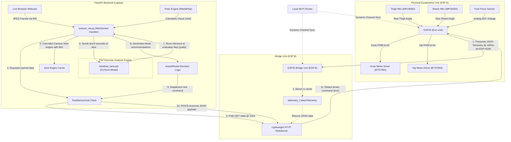

# 📂 Complete Walkthrough of the `esp_code` Folder

This document provides a **detailed, code-block-level** guide to every file in the `esp_code` directory — what each function does, how data flows between ESP A → ESP B → Backend → ML Inference, and exactly which backend code sections to check when troubleshooting hardware connection errors.

---

## 🗺️ Folder Structure

```
esp_code/
├── esp_to_esp/                       # [FOLDER] ESP A (Exo Unit) Arduino Sketch
│   └── esp_to_esp.ino                # Reads sensors, drives motors, sends JSON telemetry
├── esp_to_website/                   # [FOLDER] ESP B (Bridge Unit) Arduino Sketch
│   └── esp_to_website.ino            # WiFi gateway, receives JSON, serves HTTP endpoints
├── test_esp_communication.py         # Python script to test connection & feedback loop
├── TESTING_GUIDE.md                  # Step-by-step guide to run & test
├── esp_code_walkthrough.md           # This file
├── install_driver.bat                # One-click CP2102 USB driver installer
├── silabser.inf / silabser.cat       # Driver configuration files
└── [arm/ arm64/ x64/ x86/]           # Driver binaries for different Windows architectures
```

---

## 🔄 Data Flow Overview

```
┌─────────────────────────────────────────────────────────────────────────┐
│                         FULL DATA PIPELINE                             │
│                                                                        │
│  ESP A (Exo Unit)                ESP B (Bridge Unit)                   │
│  ┌────────────────┐   ESP-NOW    ┌────────────────────┐   HTTP        │
│  │ IMU sensors    │──(JSON)────▶ │ onDataRecv()       │──GET /data──▶ │
│  │ FSR sensor     │              │ latestTelemetry     │              │
│  │ Motor drivers  │◀──(binary)───│ relayCommandToExo() │◀─POST /cmd── │
│  └────────────────┘              └────────────────────┘              │
│                                                                        │
│  Backend (Python FastAPI)                                              │
│  ┌─────────────────────────────────────────────────────────────────┐  │
│  │ __init__.py → get_sensor_hub() → RealSensorHub                  │  │
│  │ real_sensor.py → _background_poll_loop() polls GET /data        │  │
│  │ real_sensor.py → _parse_exo_data() parses JSON into ExoSensorData│  │
│  │ session_ws.py → poll_once() → overrides camera angles           │  │
│  │ session_ws.py → analyze_rep() → ML inference on angles          │  │
│  │ session_ws.py → POST /exercise to ESP B → relayed to ESP A      │  │
│  └─────────────────────────────────────────────────────────────────┘  │
└─────────────────────────────────────────────────────────────────────────┘
```

### The JSON Packet (the single format used everywhere)

```json
{
  "knee_angle": 75.3,
  "hip_angle": 45.1,
  "foot_force": 3.42,
  "stance": true,
  "knee_pwm": 95,
  "knee_dir": "ext",
  "hip_pwm": 60,
  "hip_dir": "ext",
  "motors": "on"
}
```

| Field | Type | Range | Source |
|-------|------|-------|--------|
| `knee_angle` | float | 0 – 130° | Computed from two MPU6050 IMUs (thigh - shank pitch) |
| `hip_angle` | float | -30 – 120° | Thigh IMU pitch angle |
| `foot_force` | float | 0 – ~10 N | FSR analog reading → voltage → resistance → force |
| `stance` | bool | true/false | `true` when `foot_force > 2.0 N` |
| `knee_pwm` | int | 0 – 255 | PWM speed value applied to knee motor |
| `knee_dir` | string | `"ext"` / `"flex"` | Extension = forward, Flexion = backward |
| `hip_pwm` | int | 0 – 255 | PWM speed value applied to hip motor |
| `hip_dir` | string | `"ext"` / `"flex"` | Same as knee_dir |
| `motors` | string | `"on"` / `"off"` | Whether any motor mode is active |

---

## 📄 File 1: `esp_to_esp/esp_to_esp.ino` (ESP A — Exo Unit)

This is the firmware for the **physical exoskeleton**. It reads sensors, drives motors, and transmits telemetry as JSON over ESP-NOW radio to ESP B.

### Includes & Libraries (Lines 20–26)

```cpp
#include <esp_now.h>       // ESP-NOW peer-to-peer radio protocol
#include <WiFi.h>          // WiFi station mode (required by ESP-NOW)
#include <esp_wifi.h>      // Low-level WiFi channel control
#include <Wire.h>          // I2C bus for IMU sensors
#include <MPU6050.h>       // IMU sensor driver library
#include <I2Cdev.h>        // I2C device helper
#include <ArduinoJson.h>   // JSON serialization for telemetry packets
```

> **Arduino Library Manager**: Install `MPU6050` by Electronic Cats, `ArduinoJson` by Benoit Blanchon, `I2Cdev` by Jeff Rowberg.

---

### Configuration Block (Lines 28–33)

```cpp
uint8_t bridgeMAC[] = {0xB4, 0xBF, 0xE9, 0x0E, 0x13, 0x68};
#define WIFI_CHANNEL 11
```

- **`bridgeMAC`**: The MAC address of ESP B. You get this from ESP B's Serial Monitor on boot (it prints `Bridge Unit ready. MAC: XX:XX:XX:XX:XX:XX`). **If this is wrong, ESP A will send into the void.**
- **`WIFI_CHANNEL`**: Must match the WiFi channel that ESP B connected to. ESP B prints this: `WiFi channel: N`. **If mismatched, packets silently fail.**

---

### Motor Pin Definitions (Lines 35–54)

```cpp
// Knee motor (BTS7960 H-Bridge)
#define KNEE_RPWM  4    // PWM signal for forward/extension
#define KNEE_LPWM  16   // PWM signal for backward/flexion
#define KNEE_R_EN  17   // Enable pin for forward channel
#define KNEE_L_EN  5    // Enable pin for backward channel

// Hip motor (BTS7960 H-Bridge)
#define HIP_RPWM   13
#define HIP_LPWM   14
#define HIP_R_EN   15
#define HIP_L_EN   12

// Foot force sensor
#define FSR_PIN    34   // ADC-capable GPIO (analog read)
```

Each BTS7960 driver uses 4 pins: 2 PWM pins control speed in each direction, 2 enable pins activate the H-bridge channels. The motor spins forward (extension) when `RPWM > 0, LPWM = 0`, and backward (flexion) when `RPWM = 0, LPWM > 0`.

---

### Motor PWM Configuration (Lines 51–60)

```cpp
#define PWM_FREQ   20000   // 20 kHz — above human hearing to avoid motor whine
#define PWM_RES    8       // 8-bit → values 0 to 255
#define PWM_MAX    255

#define TORQUE_TO_PWM_SCALE 150.0  // 1.0 Nm → 150 PWM out of 255
#define MAX_TORQUE 2.0             // Clamp to 2.0 Nm max
```

The website sends a torque value (0.0–2.0 Nm). The `TORQUE_TO_PWM_SCALE` converts this to a PWM duty cycle. At max torque (2.0 Nm), PWM = `2.0 * 150 = 300`, clamped to 255.

---

### Sensor Objects & State Variables (Lines 62–93)

```cpp
MPU6050 mpu_thigh(0x68);  // I2C address 0x68 (AD0 pin LOW)
MPU6050 mpu_shank(0x69);  // I2C address 0x69 (AD0 pin HIGH)
```

Two IMUs on the same I2C bus, differentiated by the AD0 pin voltage. The thigh sensor is at the default address, shank has AD0 pulled HIGH.

**State variables tracked every loop cycle:**

| Variable | Purpose |
|----------|---------|
| `knee_angle` | Computed angle (thigh_pitch − shank_pitch), clamped 0–130° |
| `hip_angle` | Thigh pitch angle directly, clamped -30–120° |
| `foot_force` | FSR-derived force in Newtons |
| `stance_detected` | `true` when `foot_force > 2.0 N` |
| `motor_enabled` | `true` when mode ≠ 0 |
| `knee_pwm`, `hip_pwm` | Current PWM values being sent to motors |
| `knee_dir_forward`, `hip_dir_forward` | `true` = extension, `false` = flexion |
| `current_mode_id` | 0 = Off, 1 = Stance-Assist, 2 = Constant Assist |
| `current_target_torque` | Torque target received from website (0.0–2.0 Nm) |

---

### Incoming Command Struct (Lines 95–102)

```cpp
typedef struct {
  int mode_id;        // 0=Off, 1=Stance-Assist, 2=Constant-Assist
  float target_torque; // 0.0 to 2.0 Nm
} exercise_cmd_t;
```

This binary struct is what ESP B sends back to ESP A when the website issues a mode command. It stays as binary (not JSON) because the command path is simpler (only 2 fields) and latency matters for motor control.

---

### ESP-NOW Radio Callbacks (Lines 104–119)

```cpp
void onDataRecv(const esp_now_recv_info_t *info, const uint8_t *data, int len) {
  if (len != sizeof(exercise_cmd_t)) return;  // Drop corrupted packets
  memcpy(&incomingCommand, data, sizeof(incomingCommand));
  current_mode_id = incomingCommand.mode_id;
  current_target_torque = incomingCommand.target_torque;
}
```

**What happens**: When ESP B relays a mode command, this callback fires automatically. It copies the binary struct into `incomingCommand` and updates the active mode/torque. The `applyControl()` function in the main loop then reads these to adjust motor output.

> The `#if ESP_ARDUINO_VERSION` preprocessor guard handles API differences between Arduino-ESP32 v2 and v3+.

---

### Motor Control Functions (Lines 121–159)

#### `setupPWM()` (Line 123)
Attaches the 4 PWM pins (2 per motor) to the LEDC hardware timer at 20 kHz, 8-bit resolution.

#### `stopAllMotors()` (Line 131)
Immediately sets all 4 PWM outputs to 0 and resets `knee_pwm` / `hip_pwm` to 0. Used on boot and when mode = 0.

#### `driveKneeMotor(int pwm, bool forward)` (Line 138)
- `forward = true` → writes `pwm` to `KNEE_RPWM`, 0 to `KNEE_LPWM` (extension)
- `forward = false` → writes 0 to `KNEE_RPWM`, `pwm` to `KNEE_LPWM` (flexion)
- Constrains PWM to 0–255 range.

#### `driveHipMotor(int pwm, bool forward)` (Line 150)
Same logic as knee motor but on hip pins.

---

### IMU Sensor Reading (Lines 161–204)

#### `readMPU(MPU6050 &mpu, float &pitch, float &gyro_offset)` (Line 163)

The core angle calculation function. For each IMU:

1. **Reads raw 6-axis data**: `getMotion6()` returns acceleration (ax, ay, az) and gyroscope (gx, gy, gz).
2. **Accelerometer pitch**: Uses `atan2(-ax, sqrt(ay² + az²))` to get absolute pitch from gravity direction. Accurate long-term but noisy short-term.
3. **Gyroscope rate**: `(gx - offset) / 131.0` converts raw gyro value to degrees/second (at ±250°/s range, LSB = 131).
4. **Complementary filter** (Line 177): `pitch = 0.98 * (pitch + gyro_rate * dt) + 0.02 * acc_pitch`
   - 98% weight on gyro integration (fast, smooth, but drifts over time)
   - 2% weight on accelerometer (noisy but drift-free)
   - This eliminates both gyro drift and accelerometer jitter.

#### `calibrateIMU(MPU6050 &mpu, float &gyro_offset)` (Line 181)

Called once on boot. Takes 100 gyro readings over 500ms with the device still, averages them to find the baseline offset. This offset is subtracted from every future gyro reading.

> **⚠️ Keep the exoskeleton perfectly still during the ~1 second boot calibration or angles will be wrong.**

#### `readIMUs()` (Line 193)

Calls `readMPU()` for both sensors, then:
- `knee_angle = thigh_pitch - shank_pitch` (the angle between thigh and calf)
- `hip_angle = thigh_pitch` (absolute thigh angle = hip flexion)
- Both are clamped to safe ranges.

---

### Foot Force Sensor Reading (Lines 206–233)

#### `readFSR()` (Line 208)

Converts the FSR analog reading to force in Newtons:

1. **ADC → Voltage**: `voltage = (raw / 4095.0) * 3.3` (12-bit ADC, 3.3V reference)
2. **Voltage → Resistance**: Using voltage divider formula with a 10kΩ reference resistor: `R_fsr = 10000 * (3.3 - V) / V`
3. **Resistance → Force**: `conductance = 1/R`, `force = conductance * 1e6 / 800.0`
4. **Low-pass filter** (Line 228): `filtered = 0.9 * prev + 0.1 * new` — smooths out sensor spikes.
5. **Stance detection** (Line 232): `stance_detected = (foot_force > 2.0)` — 2N threshold means the foot is on the ground.

---

### Motor Control Modes (Lines 240–286)

#### `applyControl()` (Line 242)

This is the motor decision logic that runs every loop cycle:

**Mode 0 — Off / Safe Stop** (Line 244):
```cpp
motor_enabled = false;
stopAllMotors();
return;
```

**Mode 1 — Gait-Triggered Assist** (Line 255):
Only activates motors when **both** conditions are met:
- Foot is on ground (`stance_detected == true`)
- Joint angle exceeds threshold (knee > 30°, hip > 20°)

PWM is proportionally scaled: `torque * SCALE * (angle - threshold) / range`. This means more assist at higher flexion angles.

**Mode 2 — Constant Assist** (Line 272):
Applies constant PWM regardless of gait phase: `torque * TORQUE_TO_PWM_SCALE`. Both joints get the same scaled PWM in the extension direction.

After computing `knee_pwm`/`hip_pwm`, the function calls `driveKneeMotor()` and `driveHipMotor()` to apply them.

---

### ESP A doesn't have a hardcoded WiFi channel anymore; it uses WiFiManager to connect to your local router WiFi. Once connected, its WiFi channel dynamically matches the router's assigned channel (which will match ESP B because they connect to the same router).

**How it works:**
1. Starts station mode.
2. Reads the BOOT button (GPIO 0). If held, clears saved WiFi credentials.
3. Tries to connect to the saved network. If it fails, hosts a local Access Point named `"Samarth-ESP32-Exo-Setup"`.
4. Once connected to WiFi, queries `WiFi.channel()` to dynamically set the ESP-NOW channel.
5. Disables WiFi power saving for maximum throughput.
6. Initializes ESP-NOW and registers callbacks.
7. Adds ESP B as a peer using `bridgeMAC`.

> **If `"Failed to add bridge peer"` appears in Serial Monitor**, the MAC address is likely wrong.

---

### JSON Telemetry Transmission (Lines 313–333)

#### `sendTelemetry()` (Line 314)

This is the key function that sends sensor data to ESP B:

```cpp
JsonDocument doc;
doc["knee_angle"]  = knee_angle;
doc["hip_angle"]   = hip_angle;
doc["foot_force"]  = foot_force;
doc["stance"]      = stance_detected;
doc["knee_pwm"]    = knee_pwm;
doc["knee_dir"]    = knee_dir_forward ? "ext" : "flex";
doc["hip_pwm"]     = hip_pwm;
doc["hip_dir"]     = hip_dir_forward ? "ext" : "flex";
doc["motors"]      = motor_enabled ? "on" : "off";

char jsonBuffer[256];
size_t len = serializeJson(doc, jsonBuffer, sizeof(jsonBuffer));
esp_now_send(bridgeMAC, (uint8_t*)jsonBuffer, len);
```

**What it does**:
1. Builds a `JsonDocument` with all 9 telemetry fields.
2. Converts boolean motor directions to `"ext"`/`"flex"` strings.
3. Converts motor enabled state to `"on"`/`"off"` string.
4. Serializes to a char buffer (max 256 bytes — actual JSON is ~150 bytes).
5. Sends the raw JSON bytes over ESP-NOW radio to ESP B.

> ESP-NOW has a 250-byte payload limit. The JSON is ~150 bytes, well within limits.

---

### `setup()` — Boot Sequence (Lines 335–374)

Runs once on power-up:

| Step | Line | What happens |
|------|------|-------------|
| 1 | 388 | Start Serial at 115200 baud |
| 2 | 391 | Start I2C bus (SDA=21, SCL=22) at 400kHz |
| 3 | 395–400 | Initialize both IMUs and halt if either fails |
| 4 | 402–403 | Set gyro range to ±250°/s |
| 5 | 406–410 | Calibrate both gyros (keep still!) |
| 6 | 413–418 | Setup motor PWM, enable all H-bridge channels, stop motors |
| 7 | 421 | `initWiFi()` — connect to WiFi or start captive portal |
| 8 | 422 | `initESPNow()` — start radio and peer dynamically |
| 9 | 424–425 | Print MAC address (copy this to ESP B's `exoMAC[]`) |

---

### `loop()` — Main Loop (Lines 376–392)

```cpp
void loop() {
  readIMUs();        // Read both IMU sensors → knee_angle, hip_angle
  readFSR();         // Read foot force → foot_force, stance_detected
  applyControl();    // Apply motor control based on mode/torque

  if (now - lastTelemetryTime >= TELEMETRY_INTERVAL) {  // Every 10ms (100 Hz)
    sendTelemetry();  // Serialize JSON and send via ESP-NOW
  }
  delay(1);  // 1ms yield for ESP32 background tasks
}
```

Sensors are read and motors adjusted as fast as possible (~200Hz). Telemetry JSON is sent at 100Hz to avoid flooding the radio link.

---
---

## 📄 File 2: `esp_to_website/esp_to_website.ino` (ESP B — Bridge Unit)

This is the firmware for the **WiFi gateway** ESP32. It receives JSON telemetry from ESP A over radio, and serves it to the backend over HTTP.

### Includes & Libraries (Lines 19–24)

```cpp
#include <esp_now.h>        // ESP-NOW radio for communication with ESP A
#include <WiFi.h>           // WiFi for network connection
#include <esp_wifi.h>       // Low-level WiFi channel control
#include <WebServer.h>      // HTTP server library
#include <ArduinoJson.h>    // JSON parsing (incoming from ESP A) and serialization (HTTP responses)
#include <WiFiManager.h>    // Captive portal for WiFi credential setup
```

> **Arduino Library Manager**: Install `WiFiManager` by tzapu, `ArduinoJson` by Benoit Blanchon.

---

### Configuration Block (Lines 26–35)

```cpp
uint8_t exoMAC[] = {0xAA, 0xBB, 0xCC, 0xDD, 0xEE, 0xFF};
#define WIFI_CHANNEL 6
#define WIFI_RESET_PIN 0  // BOOT button on ESP32 dev board
```

- **`exoMAC`**: MAC address of ESP A. Get this from ESP A's Serial Monitor: `Exo Unit ready. MAC: XX:XX:XX:XX:XX:XX`. **Must be correct for commands to reach ESP A.**
- **`WIFI_CHANNEL`**: Automatically determined when WiFi connects, but the `#define` is a fallback. The actual channel is read from `WiFi.channel()` after connection.
- **`WIFI_RESET_PIN`**: Hold GPIO 0 (BOOT button) during power-on to erase saved WiFi credentials and re-enter setup portal.

---

### Data Structures (Lines 37–60)

```cpp
// Command sent TO ESP A (binary struct — low latency)
typedef struct {
  int mode_id;         // 0=Off, 1=Stance-Assist, 2=Constant-Assist
  float target_torque; // 0.0 to 2.0 Nm
} exercise_cmd_t;

// Local cache of latest telemetry FROM ESP A (populated by JSON parsing)
typedef struct {
  float battery_percent;
  bool  calibration_status;
  float knee_angle, hip_angle, foot_force;
  bool  stance;
  int   knee_motor_pwm, hip_motor_pwm;
  bool  knee_motor_dir, hip_motor_dir;
  bool  motors_active;
} telemetry_t;

telemetry_t latestTelemetry = {};
bool telemetryReceived = false;  // Flips to true on first packet from ESP A
```

The `telemetry_t` struct is an internal cache. ESP B receives JSON from ESP A, parses it, and stores the values here. The HTTP endpoints then read from this cache to build their responses.

---

### ESP-NOW Receive Callback — JSON Parser (Lines 67–102)

#### `onDataRecv()` (Line 73)

This is the **most critical function** in ESP B. It fires automatically whenever ESP A sends a packet:

```cpp
void onDataRecv(const esp_now_recv_info_t *info, const uint8_t *data, int len) {
  JsonDocument doc;
  DeserializationError err = deserializeJson(doc, (const char*)data, len);
  if (err) {
    Serial.print("ESP-NOW JSON parse error: ");
    Serial.println(err.c_str());
    return;
  }

  latestTelemetry.knee_angle      = doc["knee_angle"] | 0.0f;
  latestTelemetry.hip_angle       = doc["hip_angle"] | 0.0f;
  latestTelemetry.foot_force      = doc["foot_force"] | 0.0f;
  latestTelemetry.stance          = doc["stance"] | false;
  latestTelemetry.knee_motor_pwm  = doc["knee_pwm"] | 0;
  latestTelemetry.knee_motor_dir  = (strcmp(doc["knee_dir"] | "ext", "ext") == 0);
  latestTelemetry.hip_motor_pwm   = doc["hip_pwm"] | 0;
  latestTelemetry.hip_motor_dir   = (strcmp(doc["hip_dir"] | "ext", "ext") == 0);
  latestTelemetry.motors_active   = (strcmp(doc["motors"] | "off", "on") == 0);
  latestTelemetry.battery_percent = 100;
  latestTelemetry.calibration_status = true;
  telemetryReceived = true;
}
```

**Step by step:**
1. Casts the raw byte buffer to a string and parses as JSON.
2. If parsing fails, prints the error to Serial and discards the packet.
3. Extracts each field with `| default` fallback operators.
4. Converts string directions (`"ext"`/`"flex"`) back to booleans for internal storage.
5. Converts `"on"`/`"off"` motors string back to boolean.
6. Sets `telemetryReceived = true` so HTTP endpoints know data is available.

> **Troubleshooting**: If you see `"ESP-NOW JSON parse error"` in ESP B's Serial Monitor, ESP A is sending malformed data. Check that ESP A's `sendTelemetry()` function compiles correctly.

---

### Command Relay (Lines 104–118)

#### `relayCommandToExo()` (Line 105)

```cpp
void relayCommandToExo(int mode_id, float target_torque) {
  exercise_cmd_t cmd;
  cmd.mode_id = mode_id;
  cmd.target_torque = target_torque;
  esp_now_send(exoMAC, (uint8_t*)&cmd, sizeof(cmd));
}
```

Packs the mode/torque into a binary struct and sends it over ESP-NOW to ESP A. This is called by the HTTP POST handlers when the backend issues a mode command.

---

### HTTP Endpoint Handlers (Lines 120–235)

ESP B runs a web server on port 80. These are the handlers the backend calls:

#### `handleExercise()` — `POST /exercise` (Line 123)

**Called by**: `session_ws.py` Line 308–311 (WebSocket handler sends mode commands after ML rep analysis).

```cpp
// Parses JSON body: {"mode_id": 1, "target_torque": 0.5}
// Relays to ESP A via ESP-NOW
```

This is the **primary route the backend uses** to send motor commands after ML inference decides the assist mode.

---

#### `handleTelemetry()` — `GET /telemetry` (Line 145)

Legacy endpoint that returns raw boolean values for motor directions. Returns the full `telemetry_t` struct as JSON with booleans. Not used by the current backend but kept for backward compatibility.

---

#### `handleData()` — `GET /data` (Line 166) ⭐ PRIMARY ENDPOINT

**Called by**: `real_sensor.py` Line 97 (`_background_poll_loop`) and Line 137 (`connect`).

```cpp
doc["knee_angle"]  = latestTelemetry.knee_angle;
doc["hip_angle"]   = latestTelemetry.hip_angle;
doc["foot_force"]  = latestTelemetry.foot_force;
doc["stance"]      = latestTelemetry.stance;
doc["knee_pwm"]    = latestTelemetry.knee_motor_pwm;
doc["knee_dir"]    = latestTelemetry.knee_motor_dir ? "ext" : "flex";
doc["hip_pwm"]     = latestTelemetry.hip_motor_pwm;
doc["hip_dir"]     = latestTelemetry.hip_motor_dir ? "ext" : "flex";
doc["motors"]      = latestTelemetry.motors_active ? "on" : "off";
doc["battery_percent"]    = latestTelemetry.battery_percent;
doc["calibration_status"] = ... ? "calibrated" : "uncalibrated";
doc["connected"]          = telemetryReceived;
```

**This is the endpoint the backend polls every 100ms.** The JSON output matches exactly what `_parse_exo_data()` in the backend expects. It converts internal booleans back to the same `"ext"`/`"flex"` and `"on"`/`"off"` string format.

> The `"connected"` field tells the backend whether ESP B has ever received a packet from ESP A. If `false`, it means ESP A is not communicating.

---

#### `handleStatus()` — `GET /status` (Line 188)

**Called by**: `real_sensor.py` Line 83 and Line 128 (connection probing).

Returns device info: `device_id`, `battery_percent`, `calibration_status`, `connected`, `ip`, `channel`, `uptime_ms`. Used by the backend to verify ESP B is alive and get its WiFi channel.

---

#### `handleCommand()` — `POST /command` (Line 204)

Same as `/exercise` but using the `/command` route name. The backend's `RealSensorHub.send_command()` (Line 244) uses this route.

---

#### `handleCalibrate()` — `POST /calibrate` (Line 226)

Returns calibration status. Calibration is actually done automatically on ESP A boot, so this just reports the current state.

---

### WiFi Connection — WiFiManager (Lines 237–287)

#### `initWiFi()` (Line 238)

Uses the `WiFiManager` library for a captive-portal WiFi setup:

1. **Check BOOT button** (Line 265): If GPIO 0 is held LOW during boot, clears saved credentials.
2. **Auto-connect** (Line 276): Tries saved WiFi credentials first.
3. **Captive portal fallback**: If no saved credentials, starts an AP named `"Samarth-ESP32-Setup"` with a styled configuration page.
4. **Prints IP and channel**: After connecting, prints the assigned IP (needed for `.env`) and WiFi channel (needed for ESP A's `WIFI_CHANNEL`).

> The captive portal has custom Samarth-branded CSS styling (Lines 241–256).

---

### ESP-NOW Init (Lines 289–312)

#### `initESPNow()` (Line 290)

1. Reads the WiFi channel assigned by the router: `WiFi.channel()`
2. Sets ESP-NOW to use the same channel.
3. Registers send/receive callbacks.
4. Adds ESP A as a peer using `exoMAC`.

---

### `setup()` — Boot Sequence (Lines 314–339)

| Step | Line | What happens |
|------|------|-------------|
| 1 | 316–317 | Start Serial, 500ms delay for stability |
| 2 | 321 | `initWiFi()` — connect to WiFi or start captive portal |
| 3 | 324 | `initESPNow()` — start radio on same WiFi channel |
| 4 | 327–332 | Register all 6 HTTP routes |
| 5 | 333 | Start HTTP server on port 80 |
| 6 | 335–338 | Print MAC address and ready message |

---

### `loop()` — Main Loop (Lines 341–345)

```cpp
void loop() {
  server.handleClient();  // Process incoming HTTP requests
}
```

The loop only handles HTTP requests. ESP-NOW data arrives via the `onDataRecv()` interrupt callback — it doesn't need to be polled.

---
---

## 📄 File 3: `test_esp_communication.py` (Hardware Test Script)

A standalone Python script to verify the entire ESP A ↔ ESP B ↔ laptop communication path **without starting the full backend**.

### Usage

```bash
pip install requests
python test_esp_communication.py --ip 192.168.x.x
```

### Tests Performed

| Test | What it does | What it verifies |
|------|-------------|-----------------|
| **Test 1: Ping** (Line 39) | `GET /status` | ESP B is powered on and reachable on the network |
| **Test 2: Read Data** (Line 66) | `GET /data` | ESP B is receiving telemetry from ESP A |
| **Test 3: Send Command** (Line 111) | `POST /exercise` `{"mode_id":1, "target_torque":0.5}` | Command path from laptop → ESP B → ESP A works |
| **Test 4: Backend Route** (Line 128) | `POST /command` `{"mode_id":2, "target_torque":1.0}` | The route used by `RealSensorHub` works |
| **Test 5: Loop** (Line 176) | 10s continuous read+command at 10Hz | Stress test — measures latency and error rate |

### Key Output to Watch For

- `connected: false` in Test 2 → ESP A is not sending data to ESP B. Check MAC addresses and WiFi channel.
- `ConnectionError` in Test 1 → ESP B is not on the network. Check WiFi credentials.
- After all tests pass, the script prints the `.env` values to set.

---
---

## 🔧 Backend Files & Troubleshooting Reference

When hardware connection issues occur, these are the specific backend files and code sections to check:

---

### File: `backend/.env` (Lines 55–61)

```env
PS3_ESP_URL=http://192.168.x.x        # ← ESP B's IP address (from Serial Monitor)
PS3_USE_REAL_SENSOR=true               # ← Must be "true" to use real hardware
PS3_POLL_INTERVAL_MS=100               # ← How often backend polls ESP B (milliseconds)
```

| Error | What to check |
|-------|--------------|
| Backend uses MockSensorHub instead of Real | `PS3_USE_REAL_SENSOR` must be `true` AND `PS3_ESP_URL` must be non-empty |
| Backend connects but data is stale | Reduce `PS3_POLL_INTERVAL_MS` (default 100ms is fine) |
| IP address changed after ESP B reboot | Update `PS3_ESP_URL` with new IP from ESP B's Serial Monitor |

---

### File: `backend/services/sensor_hub/__init__.py` (Lines 12–32)

#### `get_sensor_hub()` (Line 12)

```python
def get_sensor_hub() -> MockSensorHub | RealSensorHub:
    if _sensor_hub is None:
        if settings.PS3_USE_REAL_SENSOR and getattr(settings, "PS3_ESP_URL", ""):
            _sensor_hub = RealSensorHub(
                esp_url=settings.PS3_ESP_URL,
                poll_interval_ms=getattr(settings, "PS3_POLL_INTERVAL_MS", 100),
            )
            _sensor_hub.connect()
        else:
            _sensor_hub = MockSensorHub()
    return _sensor_hub
```

**This is the factory function** that decides whether to use real hardware or mock data. It's a singleton — once created, it persists for the entire backend lifetime.

| Error | What to check |
|-------|--------------|
| Always returns MockSensorHub | Check that both `PS3_USE_REAL_SENSOR=true` AND `PS3_ESP_URL` is set in `.env`. Also check that the `try/except` on Line 30 isn't silently catching an import error. |
| Need to reconnect after ESP reboot | Call `reset_sensor_hub()` (Line 35) to destroy the singleton, then the next `get_sensor_hub()` call will create a fresh connection. |

---

### File: `backend/services/sensor_hub/real_sensor.py`

This is the **main backend driver** for ESP32 communication. Here are the critical sections:

#### `connect()` (Lines 112–162)

```python
def connect(self, port: str = "") -> dict:
    resp = client.get(f"{self._esp_url}/status")   # Line 128 — probe ESP B
    resp = client.get(f"{self._esp_url}/data")      # Line 137 — fetch first data frame
    self._thread = threading.Thread(target=self._background_poll_loop, daemon=True)
    self._thread.start()                             # Line 152 — start background poller
```

| Error | What to check | Line |
|-------|--------------|------|
| `"Cannot reach ESP32 at ..."` | ESP B is not powered on, or IP is wrong, or laptop is on different WiFi | 160 |
| `"ESP32 responded with HTTP {status}"` | ESP B returned a non-200 response — check ESP B Serial Monitor | 158 |
| Connection succeeds but data stops | Check `_heartbeat_timeout` (default 10s). If no data for 10s, ESP32 is marked disconnected | 106 |

---

#### `_background_poll_loop()` (Lines 68–110)

```python
def _background_poll_loop(self):
    with httpx.Client(timeout=1.0) as client:
        while not self._stop_event.is_set():
            if self._connected:
                resp = client.get(f"{self._esp_url}/data")  # Line 97
                raw = resp.json()
                self._latest_exo = self._parse_exo_data(raw)  # Line 100
```

This thread runs continuously, polling `GET /data` from ESP B every `_poll_interval` seconds (default 100ms). The data is cached in `self._latest_exo`.

| Error | What to check | Line |
|-------|--------------|------|
| `"[PS3] Background poll failed: ..."` | Network timeout or ESP B crashed — check Serial Monitor | 104 |
| Data stops updating (angles frozen) | The heartbeat check at Line 106 marks the ESP disconnected after 10s of failed polls. Check WiFi stability. |
| Thread not starting | Check that `connect()` returned `success: True` first | 148–152 |

---

#### `_parse_exo_data()` (Lines 257–285)

```python
def _parse_exo_data(self, raw: dict) -> ExoSensorData:
    return ExoSensorData(
        knee_angle=float(raw.get("knee_angle", 0)),
        hip_angle=float(raw.get("hip_angle", 0)),
        foot_force=float(raw.get("foot_force", 0)),
        stance=bool(raw.get("stance", False)),
        knee_motor=ExoMotorStatus(
            pwm=int(raw.get("knee_pwm", 0)),
            direction=str(raw.get("knee_dir", "ext")),
        ),
        hip_motor=ExoMotorStatus(
            pwm=int(raw.get("hip_pwm", 0)),
            direction=str(raw.get("hip_dir", "ext")),
        ),
        motors_active=str(raw.get("motors", "off")).lower() == "on",
    )
```

**This is where the JSON from ESP B's `/data` endpoint gets parsed into Python objects.** If the JSON keys don't match (e.g., ESP sends `"kneeAngle"` instead of `"knee_angle"`), values will silently default to 0.

| Error | What to check | Line |
|-------|--------------|------|
| All angles are 0 despite ESP sending data | JSON key names don't match — verify ESP B's `handleData()` uses exact key names: `knee_angle`, `hip_angle`, `foot_force`, `stance`, `knee_pwm`, `knee_dir`, `hip_pwm`, `hip_dir`, `motors` | 269–282 |
| `"[PS3] Exo data parse error: ..."` | ESP B returned malformed JSON — check its Serial Monitor | 284 |
| `motors_active` is always false | ESP must send `"motors": "on"` (lowercase), not `"ON"` or `true` | 281 |

---

#### `send_command()` (Lines 231–255)

```python
def send_command(self, command: dict) -> dict:
    resp = client.post(f"{self._esp_url}/command", json=command)  # Line 245
```

| Error | What to check | Line |
|-------|--------------|------|
| `"ESP32 not connected"` | `self._connected` is `False` — ESP32 heartbeat timed out or never connected | 239 |
| `"Command failed (HTTP {status})"` | ESP B rejected the command — check its Serial Monitor for errors | 252 |
| `"Command error: ..."` | Network timeout — ESP B may have crashed or WiFi dropped | 254 |

---

### File: `backend/services/sensor_hub/schemas.py`

Pydantic data models that define the exact structure the backend expects:

#### `ExoSensorData` (Lines 25–33)

```python
class ExoSensorData(BaseModel):
    knee_angle: float = 0.0
    hip_angle: float = 0.0
    foot_force: float = 0.0
    stance: bool = False
    knee_motor: ExoMotorStatus = Field(default_factory=ExoMotorStatus)
    hip_motor: ExoMotorStatus = Field(default_factory=ExoMotorStatus)
    motors_active: bool = False
```

If any field fails validation (e.g., string where float expected), Pydantic will raise an error in `_parse_exo_data()`.

---

### File: `backend/ws_handlers/session_ws.py`

This is the **WebSocket handler** that ties everything together during a live exercise session.

#### ESP32 Data Polling (Lines 148–156)

```python
current_hub = get_sensor_hub()
exo_reading = None
if isinstance(current_hub, RealSensorHub):
    exo_reading = await asyncio.to_thread(current_hub.poll_once)
```

**What it does**: On every camera frame, it polls the cached ESP32 data via `poll_once()`. This runs in a thread to avoid blocking the async event loop.

| Error | What to check |
|-------|--------------|
| `exo_reading` is always `None` | `get_sensor_hub()` returned `MockSensorHub` — check `.env` settings |
| `PS3 poll error: ...` logged | Network or threading issue — check ESP B stability |

---

#### Camera Angle Override (Lines 169–172)

```python
if exo_reading and exo_reading.connected and exo_reading.exo:
    result.angles.left_knee = exo_reading.exo.knee_angle
    result.angles.left_hip = exo_reading.exo.hip_angle
    result.pose_confidence = 1.0
```

**What it does**: When ESP32 is connected, the camera-computed knee and hip angles are **replaced** with the hardware IMU angles. This gives the ML model high-precision input. Pose confidence is set to 1.0 (maximum) because hardware IMUs are more reliable than camera.

| Error | What to check |
|-------|--------------|
| Camera angles used instead of ESP | `exo_reading.connected` is `False` — ESP heartbeat timed out |
| Only `left_knee`/`left_hip` overridden | The ESP sends a single leg's data. `right_knee`/`right_hip` still come from the camera |

---

#### ML Inference (Lines 220–229)

```python
from services.exercise_analysis import get_analyzer
analyzer = get_analyzer()
rep_analysis = analyzer.analyze_rep(rep_angles_slice, rep_id=rep_count, ...)
```

**What it does**: When a rep is detected (flexion peak above 15° followed by descent), the last 6 seconds of angle data (including ESP32-overridden values) are sent to the PS2 ML model for quality analysis.

| Error | What to check |
|-------|--------------|
| `"PS2 rep analysis failed: ..."` | Check PS2_MODEL_PATH in `.env` — model file must exist |
| Rep analysis produces wrong scores | Check that ESP32 angles are reasonable (0–130° for knee) — sensor calibration may be off |

---

#### Mode Command to ESP32 (Lines 290–329)

```python
if rep_result_data is not None and isinstance(current_hub, RealSensorHub) and current_hub.is_connected:
    esp_payload = {"mode_id": new_mode_id, "target_torque": new_torque}
    await client.post(f"{esp_base}/exercise", json=esp_payload)
```

**What it does**: After ML inference produces a mode recommendation, it sends the command to ESP B via `POST /exercise`. ESP B relays it to ESP A which adjusts the motors.

Includes **deduplication** (Lines 298–303): Only sends if mode or torque actually changed, preventing ESP32 command spam.

| Error | What to check |
|-------|--------------|
| `"ESP32 not reachable: ..."` | Network timeout during command send — ESP B may be overloaded | Line 318 |
| Commands never sent | Check that `rep_result_data` is not `None` — reps must be detected first |
| Mode commands spam ESP32 | The deduplication logic (torque change > 0.5 or mode change) should prevent this. If still spamming, check `last_mode_sent`/`last_torque_sent` persistence | Lines 296–303 |

---

### File: `backend/backend_config.py` (Lines 62–71)

All ESP32-related settings with defaults:

```python
PS3_ESP_URL: str = ""                  # e.g. "http://192.168.1.100"
PS3_USE_REAL_SENSOR: bool = False      # Set to True to use real hardware
PS3_POLL_INTERVAL_MS: int = 100        # Poll frequency in ms
PS3_RECONNECT_INTERVAL: int = 5        # Seconds between reconnect attempts
PS3_HEARTBEAT_TIMEOUT: int = 10        # Seconds before marking disconnected
PS3_COMMAND_TIMEOUT: float = 2.0       # Seconds to wait for command ACK
```

---

## 🚨 Quick Troubleshooting Checklist

| Symptom | Check ESP Side | Check Backend Side |
|---------|---------------|-------------------|
| **ESP B not reachable at all** | Is it powered on? Check Serial Monitor for IP. Is laptop on same WiFi? | `PS3_ESP_URL` in `.env` — is the IP correct? |
| **ESP B responds but `connected: false`** | ESP A is not sending. Check: MAC addresses match? `WIFI_CHANNEL` in ESP A matches ESP B's printed channel? Both ESPs powered? | This is an ESP-to-ESP issue, not backend. |
| **Backend uses MockSensorHub** | N/A | Both `PS3_USE_REAL_SENSOR=true` AND `PS3_ESP_URL=http://...` must be set in `.env` |
| **Data arrives but angles are all 0** | Check ESP A Serial Monitor for IMU errors. Is calibration completing? | `_parse_exo_data()` in `real_sensor.py` Line 257 — check JSON key name matching |
| **Motors don't respond to ML commands** | Check ESP A Serial Monitor for incoming commands. Check ESP B Serial for relay messages. | `session_ws.py` Line 290 — is `rep_result_data` being generated? Is `current_hub.is_connected` true? |
| **ESP A halts on boot** | IMU wiring issue — `"MPU6050 connection failed!"` in Serial. Check I2C wires (SDA=21, SCL=22) and AD0 pin on shank sensor. | N/A |
| **"ESP-NOW JSON parse error" on ESP B** | ESP A's `sendTelemetry()` is sending malformed JSON. Re-upload ESP A code. | N/A |
| **Backend disconnects after 10 seconds** | ESP B's HTTP server stopped responding. Check its Serial for crashes. | `_heartbeat_timeout` in `real_sensor.py` Line 50 (default 10s). Increase if WiFi is slow. |
| **Reps not detected / ML not running** | N/A | `session_ws.py` Line 187–197: knee flexion must exceed 15° with > 4.5s cooldown. Check ESP angles are in the right range. |

---

## 🗺️ Visual System Architecture & Connection Diagram

Here is how all hardware components, networking routes, local server logic, and the **RehabNet ML Model** are connected and interact during a live physical therapy session:



### Connection and Inference Flow Sequence

1. **Telemetry Capture:** ESP A reads the IMUs and FSR, calculates the knee and hip angles, packages them into a single JSON packet, and sends them via ESP-NOW to ESP B.
2. **Gateway Caching:** ESP B parses the JSON packet and updates its `latestTelemetry` memory cache.
3. **Backend Polling:** The `RealSensorHub` thread on the laptop polls `GET /data` from ESP B's HTTP web server every 100ms and updates the Python cache.
4. **Visual Override:** During a live session, the patient is in front of the webcam. The browser streams video frames to `session_ws.py`. If the ESP32 is connected, the backend **throws away the camera-calculated left knee/hip angles and replaces them with the high-precision IMU sensor data**.
5. **ML Rep Analysis:** When the patient completes a repetition, the backend extracts the last 6 seconds of data and sends it to the **RehabNet PyTorch model** (`rehabnet_best.pth`).
6. **Adaptive Assistance Loop:** The ML model evaluates the repetition quality score. If assistance is required, it recommends an exercise mode (e.g. Mode 1 - Stance-Assist) and a target torque (e.g. 1.2 Nm). The backend sends this via a `POST /exercise` HTTP request to ESP B, which immediately flashes it to ESP A via ESP-NOW. ESP A's BTS7960 drivers turn on the motors to help the patient stand up.


---

## 📋 Files to Flash

| ESP Board | File to Upload | Libraries Needed |
|-----------|---------------|-----------------|
| **ESP A** (on the exoskeleton) | `esp_to_esp/esp_to_esp.ino` | `MPU6050`, `I2Cdev`, `ArduinoJson`, `ESP32 Board Package` |
| **ESP B** (the WiFi bridge) | `esp_to_website/esp_to_website.ino` | `ArduinoJson`, `WiFiManager`, `ESP32 Board Package` |

### After Flashing

1. Power on **ESP B first** → connect it to WiFi via the captive portal → note the IP address and WiFi channel from Serial Monitor.
2. Update `WIFI_CHANNEL` in ESP A's code to match ESP B's channel.
3. Update `bridgeMAC[]` in ESP A with ESP B's MAC address (from ESP B's Serial Monitor).
4. Update `exoMAC[]` in ESP B with ESP A's MAC address (from ESP A's Serial Monitor).
5. Power on **ESP A** → keep it still during the ~1 second gyro calibration.
6. Run `python test_esp_communication.py --ip <ESP_B_IP>` to verify everything.
7. Update `backend/.env` with `PS3_ESP_URL=http://<ESP_B_IP>` and `PS3_USE_REAL_SENSOR=true`.
8. Restart the backend server.
